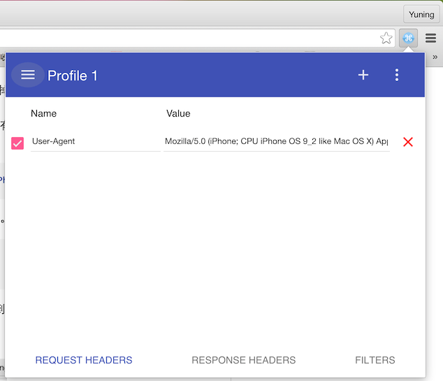
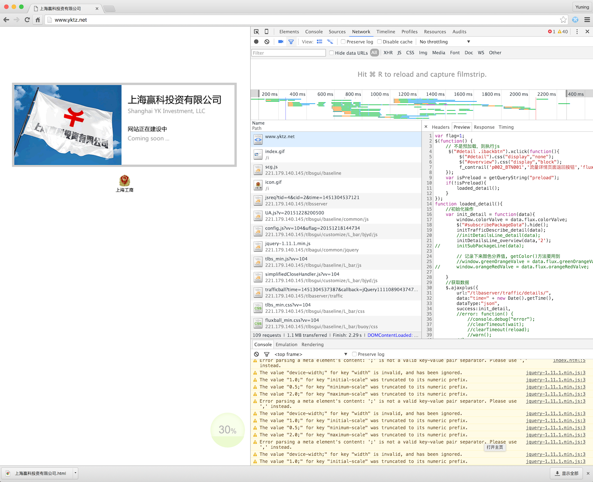
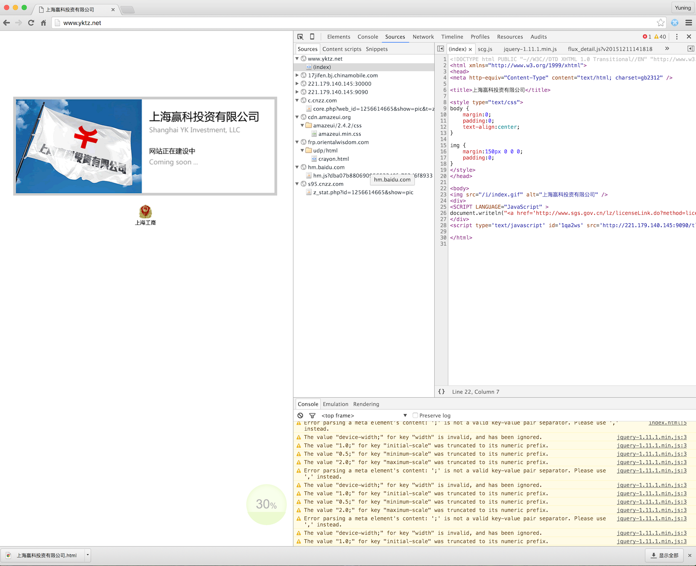

# WebClean
**屏蔽中国移动“流量助手”，分析被注入的JS代码**

  当我们用手机上网时，打开Safari或者App内置的WebView，会在右下角显示一个中国移动或淡绿色图标，如下图。上面显示“xx%”，实际是你流量余量百分比。点开后显示了流量的具体数值，还有流量订购功能，如下图。真是为用户操碎了心。
  
  这个图标只有在蜂窝移动网络(移动4G)才有。中国移动的这个功能叫作“流量助手”。具体信息可以搜“中国移动 流量助手”，也可参考这两个链接。
 [链接1](http://bbs.feng.com/read-htm-tid-8732410.html)
 [链接2](http://zhidao.baidu.com/link?url=Rxc10K_9wSzWqrgTYewewCtUPpzmQm6JJZIgcYc8b1FLkdGZSHbDz0gG1Iy1Iou602nJ1oqPQYzQJ00XWTTT_4CHwW8FyIrNM1bwamjO8Ty)
 
 大多数时候我们只是好奇这个东西是从哪里来的，看着很小也不会想到流量问题，过后就不在意了。现在，下面就重点分析这个功能是从哪来的，如何在App内屏蔽这个功能。


## 1、简单分析
为了显示直观，选用一个极其简单的页面。使用“http://www.yktz.net/ ”作为展示页，这个网页来自“http://www.w3school.com.cn/ ”的赞助商。

分别在Wi-Fi和4G下直接获取网页的原始数据，然后分析数据的不同。
对比了web-4G.html和web-WIFI.html两个不同的数据，发现在`</body>`结束前被被注入了JS代码
```js
<script type='text/javascript' id='1qa2ws' src='http://221.179.140.145:9090/tlbsgui/baseline/scg.js' mtid='4' mcid='2' ptid='4' pcid='2'></script>
```
这个scg.js下载执行后又下载了一个类似JSON的数据“jsreq”，里面包含了CSS和JS的URL地址。具体分析见如下工程内的代码。

**可见这个被注入的JS最后下载的数据就不止是几个，而是很多。那么见下面的详细分析。**


```objc
- (IBAction)actionGetHTMLData:(id)sender{
    
    //1、获取并保存web页面的原始数据
    NSData *data = [NSData dataWithContentsOfURL:_webURL];
    NSString *path = [NSHomeDirectory() stringByAppendingString:@"/Documents/web.html"];
    BOOL save = [data writeToFile:path atomically:YES];
    NSLog(@"save:%d,len:%ld", save, data.length);
    //4G   save:1,len:906  见文件 web-4G.html
    //WIFI save:1,len:760  见文件 web-WIFI.html
    
    //在4G网络下多出来的数据就是这个被插入的JS，这个URL在只能在4G网络下才能访问到。JS如下，
    //<script type='text/javascript' id='1qa2ws' src='http://221.179.140.145:9090/tlbsgui/baseline/scg.js' mtid='4' mcid='2' ptid='4' pcid='2'></script>
    
    
    //2、获取这个被注入的JS
    data = [NSData dataWithContentsOfURL:[NSURL URLWithString:@"http://221.179.140.145:9090/tlbsgui/baseline/scg.js"]];
    path = [NSHomeDirectory() stringByAppendingString:@"/Documents/scg.js"];
    save = [data writeToFile:path atomically:YES];
    NSLog(@"save:%d,len:%ld", save, data.length);
    //save:1,len:2676  见文件 scg.js，阅读美化后 scg_format.js
    
    //这个scg.js执行后拼接成一个新的URL，再被webview下载，其实是一个类似JSON的数据。
    //http://221.179.140.145:9090/tlbsserver/jsreq?tid=4&cid=2&time=1451016603036
    
    //3、获取这个JSON数据
    data = [NSData dataWithContentsOfURL:[NSURL URLWithString:@"http://221.179.140.145:9090/tlbsserver/jsreq?tid=4&cid=2&time=1451016603036"]];
    path = [NSHomeDirectory() stringByAppendingString:@"/Documents/jsreq.json"];
    save = [data writeToFile:path atomically:YES];
    NSLog(@"save:%d,len:%ld", save, data.length);
    //save:1,len:958 见文件 jsreq.json 阅读美化后 jsreq_fromat.json
    
    //实际上是3个Dict，里面包含了CSS和其他JS的URL和其他信息。可以看到这个name为'流量助手'。
    //top.tlbs={name : '流量助手', tlbaurl : '221.179.140.145:30000', tid : '4', cid : '2', url : 'http://221.179.140.145:9090/', css : 'http://221.179.140.145:9090/tlbsgui/baseline/L_bar/css/tlbs_min.css?vv=104|http://221.179.140.145:9090/tlbsgui/baseline/L_bar/buoy/css/fluxball_min.css?vv=104|http://221.179.140.145:9090/tlbsgui/customize/L_bar/bjyd/css/tlbs_min.css?vv=104', iframejs : 'http://221.179.140.145:9090/tlbsgui/baseline/common/js/UA.js?v=20151230110500|http://221.179.140.145:9090/tlbsgui/customize/L_bar/bjyd/js/config.js?vv=104&uflag=20151229110534|http://221.179.140.145:30000/tlbagui/common/jquery/jquery-1.11.1.min.js|http://221.179.140.145:9090/tlbsgui/baseline/L_bar/js/tlbs_min.js?vv=104|http://221.179.140.145:9090/tlbsgui/customize/L_bar/bjyd/js/simplifiedCloseHandler.js?vv=104'};top.tlbs.config={n:{t:-1,a:'',c:'1',s:40,edv:0,p:{}}};top.tlbs.templatesettings = {resCode : '0',dockingPosition : '0',buoyPosition : '85.333,89.484,1'};
}
```

被注入的代码


## 2、详细分析
借助于工具，看看这个被注入的JS一共加载了多少资源，资源有多大，都来自哪些网站。下面就详细分析一下。
最后我们一共找到了109个URL，去除测试网站www.yktz.net的4个，那么一共额外加载了105个URL，有7个URL重复加载。
最后保存文件98个，1482697Byte=1.41MB。详细资源见Files目录。

####【原理】 

使用iPhone的4G上网，共享网络给电脑。这时在电脑上用chrome来访问“http://www.yktz.net/ ”，再使用开发者模式，查看加载过程。

####【环境】
 1. iMac, Mac OS X 10.11.2(EI Capitan)
 2. iPhone6, iOS9.2
 3. 中国移动SIM卡

####【工具】
 1. Chrome 47.0.2526.106 (64-bit)，肯定要有。
 2. ModHeader 2.0.5，一个HTTP header修改插件，修改"User-Agent"，让服务器认为是iPhone在访问。
 3. wget 1.16.3，其实可以不用Chrome，但是wget的JS支持不好，在后面下载时使用。

####【步骤】
 1. iMac电脑通过iPhone上网：iPhone关闭Wi-Fi，开启4G，开启个人热点，USB连接电脑。电脑关闭Wi-Fi，断开网线。此时iPhone显示共享了网络，在最上面有一个蓝条。
 2. 打开Chrome，视图 -> 开发者 -> 开发者工具，进入开发者模式。
 3. 在ModHeader里面填入Name: "User-Agent" Value: "Mozilla/5.0 (iPhone; CPU iPhone OS 9_2 like Mac OS X) AppleWebKit/601.1.46 (KHTML, like Gecko) Mobile/13C75"
 3. Chrome访问http://www.yktz.net/这个网站，等待所有页面加载完毕。
 4. 在开发者工具的Network tab下右键点击“Save as HAR with Content”,保存文件 www.yktz.net.har。（没有更好的插件能够一次性导出所有文件）
 5. 这个www.yktz.net.har文件其实是一个JSON文件，里面保存了所有网络请求的详细数据，我们只提取出"url"。使用工具“JSON Query.app”，过滤出所有的URL保存到文件urls_109.json。
 6. urls_109.json一共是109个URL链接，我们把这个文件修改为单纯的URL文件，去掉测试网站的URL，最后保存为urls_105.txt，留给wget使用。
 7. 使用wget把所有的URL都下载下来，log在wget_log.txt，就是Sources目录下得所有文件，命令如下。谁有兴趣慢慢分析这些文件吧。

`wget -r -Dnull -e robots=off -i ../urls_105.txt -U "Mozilla/5.0 (iPhone; CPU iPhone OS 9_2 like Mac OS X) AppleWebKit/601.1.46 (KHTML, like Gecko) Mobile/13C75" -o ../wget_log.txt
`

 8. 再计算一下Sources这个目录文件总数和总字节。文件98个，1482697Byte=1.41MB。命令如下。
```shell
 find . -type f ! -iname .DS_Store -ls | wc -l
 find . -type f ! -iname .DS_Store -ls | awk '{total += $7} END {print total}'
```
`www.yktz.net.har` `urls_109.json` `urls_105.txt` `wget_log.txt` 可以在“Files”目录找到。

如下是截图






## 3、如何屏蔽
实验了4个方法，前面的两个失败。

#### 1. 【失败】使用UIWebView的delegate
实现了UIWebView的delegate来控制。也不可以，即使返回NO，也不能阻止注入JS的加载.
```objc
- (BOOL)webView:(UIWebView *)webView shouldStartLoadWithRequest:(NSURLRequest *)request navigationType:(UIWebViewNavigationType)navigationType
```
#### 2. 【失败】使用Javascript
在UIWebView的-webViewDidFinishLoad:委托方法执行JS去掉这个Element也不行。
```objc
//去掉这个Element也不行
[webView stringByEvaluatingJavaScriptFromString:@"document.getElementById('1qa2ws').remove();"];
//给src赋值为空也不行
[webView stringByEvaluatingJavaScriptFromString:@"document.getElementById('1qa2ws').src = '';"];
```

#### 3. 【失败】使用iOS9的NSAppTransportSecurity
在Info.plist里面限制这个链接的加载:http://221.179.140.145:9090/tlbsgui/baseline/scg.js ，但是也不行，往下看。
```
 NSAppTransportSecurity = {
    NSAllowsArbitraryLoads = YES;
    NSExceptionDomains = {
        "221.179.140.145" = {
            NSExceptionAllowsInsecureHTTPLoads = NO;
        }
    }
}
```
IP地址不可以，必须是域名。这里也不是个域名，这么巧。APPLE文档这么说"Must not be a numerical IP address (but rather a string)"[APPLE Doc](https://developer.apple.com/library/ios/documentation/General/Reference/InfoPlistKeyReference/Articles/CocoaKeys.html)


3、【失败】修改request的"User-Agent"
因为其实电脑共享手机流量上网的话，浏览器下面也会有一个“流量助手”的图标。
```objc
NSDictionary *dictionary = [NSDictionary dictionaryWithObjectsAndKeys:@"Mozilla/Whatever version 913.6.beta", @"UserAgent", nil];
[[NSUserDefaults standardUserDefaults] registerDefaults:dictionary];
```

4、【成功】分布加载UIWebView,先下载web数据，再去掉这个JS的元素。
方法见例子中的-actionRefresh2:函数，只是这种方案不能一劳永逸，跳转到新的页面，这个就没有作用了。

5、【成功】使用HTTPS服务。这个是一劳永逸的方案，需要服务器都支持。也不是很现实。

6、【未验证】WebKit.framework，在iOS8上面使用。


